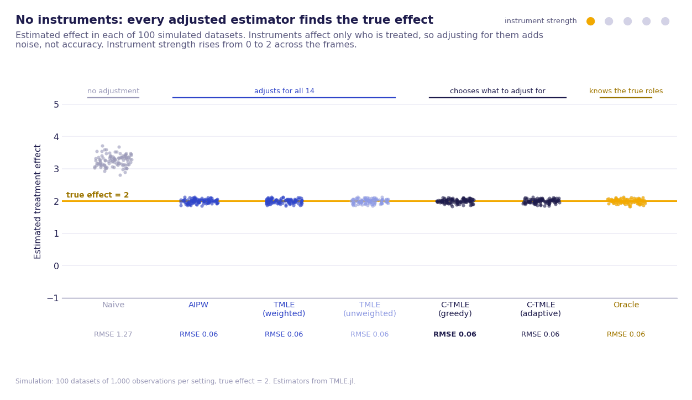
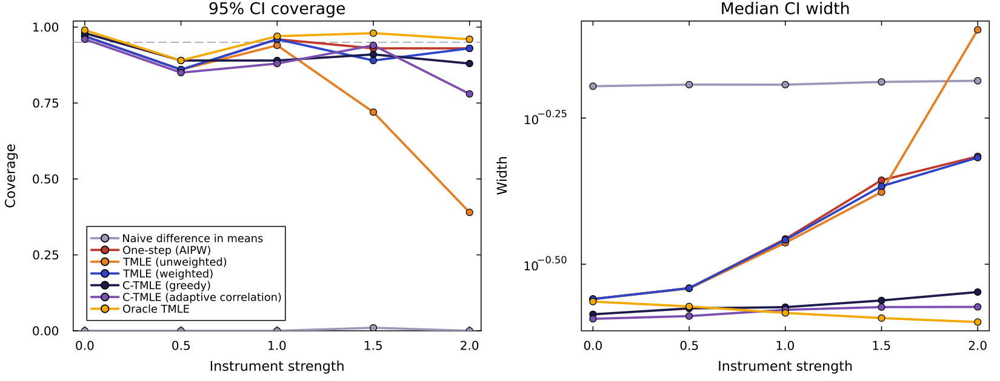
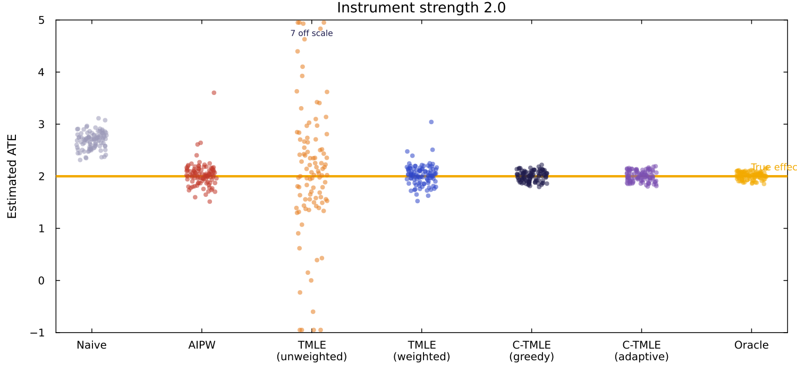

# More adjustment is not always better: TMLE vs C-TMLE in Julia

**An interactive explainer and simulation study showing when adjusting for every available covariate hurts causal effect estimates, and how Collaborative TMLE avoids it. Built with [TMLE.jl](https://github.com/TARGENE/TMLE.jl), the Julia package I contribute C-TMLE estimators to.**



## The problem

The usual instinct in observational studies is to adjust for every covariate available. That removes confounding, but covariates that affect **only who gets treated** (instruments) do no good and real harm: they push propensity scores towards 0 and 1, and estimators that weight by the propensity score become unstable, with wide intervals or wild estimates.

**Collaborative TMLE** builds the propensity score model step by step, adding a covariate only if it improves the cross-validated fit of the *targeted* outcome model. Instruments don't help with that, so C-TMLE should tend to leave them out, without being told which covariates are which.

## Design

Each simulated dataset has a binary treatment, a continuous outcome and **14 candidate covariates** with roles hidden from the estimators. The true average treatment effect is always 2.

| Covariates | Role | Affects treatment | Affects outcome |
|---|---|---|---|
| `W1`–`W3` | Confounders | Yes | Yes |
| `Z1`–`Z3` | Instruments | **Yes** | No |
| `X1`–`X3` | Outcome predictors | No | Yes |
| `N1`–`N5` | Noise | No | No |

Seven estimators are compared, all but the first through TMLE.jl:

| Estimator | Covariates used |
|---|---|
| Naive difference in means | None |
| One-step (AIPW) | All 14 |
| TMLE, unweighted fluctuation | All 14 |
| TMLE, weighted fluctuation (TMLE.jl default) | All 14 |
| C-TMLE, greedy strategy | Chooses from all 14 |
| C-TMLE, adaptive correlation strategy | Chooses from all 14 |
| Oracle TMLE | True roles: confounders in the propensity score, predictors in the outcome model |

The study varies instrument strength from 0 to 2 with 100 datasets of 1,000 observations at each level, and records bias, spread, RMSE, 95% confidence interval coverage and interval width.

## Results

**Strong instruments break the estimators that adjust for everything, and C-TMLE holds up.** With no instruments, every adjusted estimator does equally well (RMSE about 0.06). As instruments strengthen, the estimators that put all 14 covariates into the propensity score get steadily worse, while C-TMLE stays close to the oracle that knows the true roles.

At the strongest setting (instrument strength 2, 100 datasets):

| Estimator | Bias | RMSE | 95% CI coverage | Median CI width |
|---|---|---|---|---|
| Naive difference in means | 0.686 | 0.704 | 0% | 0.651 |
| One-step (AIPW) | 0.031 | 0.240 | 93% | 0.484 |
| TMLE (unweighted) | 0.159 | 1.645 | 39% | 0.796 |
| TMLE (weighted) | 0.023 | 0.199 | 93% | 0.481 |
| **C-TMLE (greedy)** | **0.001** | **0.097** | **88%** | **0.283** |
| C-TMLE (adaptive correlation) | 0.002 | 0.100 | 78% | 0.267 |
| Oracle TMLE | 0.011 | 0.068 | 96% | 0.252 |

- **C-TMLE is about 2.5 times more accurate than AIPW** (RMSE 0.097 against 0.240) and twice as accurate as TMLE.jl's default weighted TMLE, with intervals about 40% narrower.
- **Unweighted TMLE collapses.** With propensity scores near 0 and 1, its targeting step occasionally produces wild estimates, so its spread is about eight times AIPW's and its intervals cover the truth only 39% of the time. The weighted fluctuation, TMLE.jl's default, avoids this.
- **The adaptive correlation strategy matches the greedy strategy's accuracy** while running roughly ten times faster, which matters for large data.
- **C-TMLE's intervals are too narrow** once instruments are strong: coverage is 88 to 91% for the greedy strategy and falls to 78% for adaptive correlation at strength 2. The standard variance estimate treats the selected propensity score model as if it had been chosen in advance, so it ignores the uncertainty from the selection itself. Accuracy is excellent, but the reported uncertainty should be treated with some caution.
- At strength 0.5 every estimator, including the oracle, covers 85 to 89%. With 100 datasets per setting, coverage estimates have a Monte Carlo error of about ±4 percentage points, so this is most likely chance.





The full table is in [`results/summary.md`](results/summary.md).

## Explore it interactively

[`notebooks/ctmle_explainer.jl`](notebooks/ctmle_explainer.jl) is a [Pluto](https://plutojl.org/) notebook with sliders for instrument strength, confounding strength, sample size and random seed. Every estimator reruns live, alongside a histogram of the propensity scores.

## Run it yourself

Requires Julia 1.10 or later.

```bash
git clone https://github.com/Asantewaah/ctmle-breakdown.git
cd ctmle-breakdown
julia --project -e 'using Pkg; Pkg.instantiate()'

# Simulation study (use N_REPS=10 for a quick test run)
julia --project -t auto scripts/run_simulation.jl
julia --project scripts/make_figures.jl

# Interactive notebook
julia --project -e 'using Pluto; Pluto.run(notebook="notebooks/ctmle_explainer.jl")'
```

(Pluto is installed globally with `julia -e 'using Pkg; Pkg.add("Pluto")'`.)

### On a cluster (Edinburgh's Eddie, SGE)

The full study (5 instrument strengths × 100 replicates) is split into a 20-task array job, one file per task in `results/batches/`, then combined:

```bash
eddie/submit.sh smoke              # setup + one task, to check timing
SKIP_SETUP=1 eddie/submit.sh       # all 20 tasks, then combine + figures
```

## Repository structure

```
├── src/simulation.jl              data-generating process, estimators, summaries
├── src/reporting.jl               writes raw results and summary tables
├── scripts/run_simulation.jl      repeated simulation → results/ (or one batch on a cluster)
├── scripts/combine_results.jl     joins cluster batches → results/
├── eddie/                         SGE job scripts for the University of Edinburgh cluster
├── scripts/make_figures.jl        figures and GIF → figures/
├── notebooks/ctmle_explainer.jl   interactive Pluto notebook
├── results/                       raw results and summary tables
└── figures/
```

## References

- van der Laan, M. J. and Gruber, S. (2010). Collaborative double robust targeted maximum likelihood estimation. *The International Journal of Biostatistics*, 6(1).
- Ju, C., Gruber, S., Lendle, S. D. et al. (2019). Scalable collaborative targeted learning for high-dimensional data. *Statistical Methods in Medical Research*, 28(2).
- Labayle, O. et al. (2025). TMLE.jl: Targeted Minimum Loss-Based Estimation in Julia. *Journal of Open Source Software*.

---

*By [Juliet Asantewaa Sarpong](https://asantewaah.github.io), PhD researcher in Statistics at the University of Edinburgh, specialising in causal inference.*